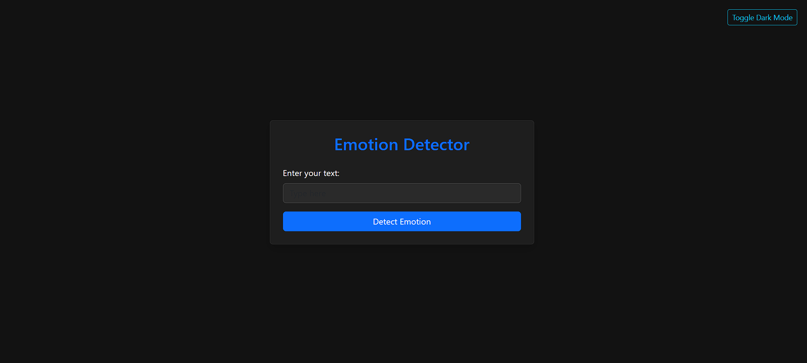

\# 😃 Emotion Detector Web App

A simple and intuitive \*\*Flask-based web application\*\* that detects emotions from user-inputted text using a powerful transformer model.

---

\# 🚀 Features

\- 🔍 Uses \[j-hartmann/emotion-english-distilroberta-base](https://huggingface.co/j-hartmann/emotion-english-distilroberta-base) from Hugging Face

\- 🌐 Clean Bootstrap UI with responsive layout

\- 🌗 Dark Mode toggle support

\- 💡 Real-time emotion detection from natural language input

\- ⚡ Fast and lightweight — easy to run locally

---

\# 📸 Screenshot

